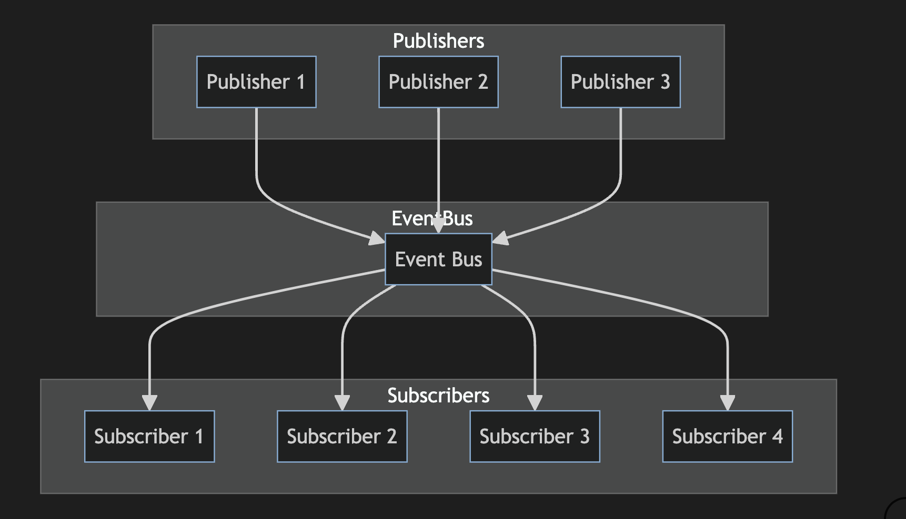

# Scaling with Event-Driven Architectures 📬📤
In this lesson, you'll learn how to implement the Publish-Subscribe (Pub/Sub) pattern, a powerful event-driven messaging pattern that decouples the sender and receiver of messages, enhancing the modularity and scalability of your applications. This pattern is particularly useful when integrating with tools like [Kafka](https://kafka.apache.org/) for handling large-scale data streams. Let's dive in!

## What is the Pub/Sub Pattern?
The Pub/Sub pattern involves three key components:

- **Publisher**: Sends messages (events) to a channel without knowing who will receive them.
- **Subscriber**: Receives messages from a channel without knowing who sent them.
- **Channel**: An intermediary that decouples publishers from subscribers.

The Pub/Sub pattern is a messaging pattern where senders (publishers) of messages do not send them directly to specific receivers (subscribers). Instead, publishers "publish" messages (events) without any knowledge of who the subscribers are. Similarly, subscribers express interest in one or more types of events and receive only those messages, without any knowledge of the publishers. An intermediary, called a "message broker" or "event bus," receives published messages and forwards them to the subscribers who are registered to receive them.

Here is a diagram illustrating the Pub/Sub design pattern:



## Advantages of Pub/Sub Implementation
### Reducing Model/Controller Bloat
It is common to have fat models or controllers in your Rails application. The Pub/Sub pattern can help decompose these fat models or controllers by distributing responsibilities.

### Separation of Concerns
This pattern helps in maintaining a clear separation of concerns, as publishers and subscribers do not need to know about each other.

### Fewer Callbacks
Intertwined callbacks between models are a known code smell. By using the Pub/Sub pattern, we can avoid tightly coupling models together, making them easier to maintain and extend.

For example, a Post model could look like this:

```ruby
# app/models/post.rb
class Post
  after_create_commit :create_feed, :notify_followers

  def create_feed
    Feed.create!(self)
  end

  def notify_followers
    User::NotifyFollowers.call(self)
  end
end
```
And the `PostsController` might look like this:

```ruby
# app/controllers/posts_controller.rb
class PostsController < ApplicationController
  def create
    @post = Post.new(post_params)
    if @post.save
      redirect_to @post
    else
      render :new, alert: "Error creating post"
    end
  end
end
```

By using the Pub/Sub pattern, this code can be refactored as follows:

```ruby
class Post < ApplicationRecord
  include Wisper::Publisher

  after_create_commit -> { publish(:post_create, self) }
end
```

```ruby
# app/controllers/posts_controller.rb
class PostsController < ApplicationController
  def create
    @post = Post.new(post_params)
    if @post.save
      redirect_to @post
    else 
      render :new
    end
  end
end
```

Subscribers only subscribe to the events they wish to respond to:

```ruby
# app/listener/feed_listener.rb
class FeedListener
  def post_create(post)
    Feed.create!(post)
  end
end
```

```ruby
# app/listener/user_listener.rb
class UserListener
  def post_create(post)
    User::NotifyFollowers.call(post)
  end
end
```

The event bus registers the different subscribers in the system:

```ruby
# config/initializers/wisper.rb
Wisper.subscribe(FeedListener.new)
Wisper.subscribe(UserListener.new)
```

In this example, the Pub/Sub pattern allows models to work independently from each other with minimal knowledge about each other, ensuring loose coupling. Expanding behavior to additional actions is just a matter of hooking into the desired event.

## Example: Financial Business Logic
Here is an example of some complex business logic implemented using the Pub/Sub pattern and service objects:

### Publisher

```ruby
# app/service/financial/order_review.rb
class Financial::OrderReview
  include Wisper::Publisher

  def self.call(order)
    if order.approved?
      publish(:order_create, order)
    else
      publish(:order_decline, order)
    end
  end
end
```

### Subscribers

```ruby
# app/listener/client_listener.rb
class ClientListener
  def order_create(order)
    Client::Charge.call(order)
    Inventory::UpdateStock.call(order)
  end

  def order_decline(order)
    Client::NotifyDeclinedOrder.call(order)
  end
end
```

## Benefits of Event-Driven Architectures

- Loose Coupling: Components are decoupled, making the system easier to extend and maintain.
- Scalability: Suitable for handling large-scale data streams with tools like Kafka.
- Flexibility: Easy to add new subscribers without changing the existing publishers.

## Disadvantages of Pub/Sub

### Inflexible Semantic Coupling
The data structure of published events must be well-defined, and changing it can be difficult because all subscribers must be compatible with the modifications. This can make refactoring more challenging.

### Messaging Bus Stability
Simple Pub/Sub tools may not ensure the stability of the messaging bus itself. For more complex systems, consider using more sophisticated message brokers like RabbitMQ, PubNub, or Kafka.

### Infinite Event Loops
Event-driven systems must be designed carefully to avoid infinite loops, where events trigger other events in a cycle that can bring the system to a standstill.

## Industry Examples of Event-Driven Architectures
- **Insurance**: Used to handle policy updates and claims processing, ensuring synchronization across underwriting, billing, and customer service systems.
- **Banking**: Manages transactions and notifications, triggering fraud detection and ledger updates.
- **Telecom**: Manages network events and customer notifications, such as service outages.
- **Manufacturing**: Monitors and controls production lines, alerting maintenance teams and updating production schedules.

## Quiz

- What is the primary role of a channel in the Pub/Sub pattern?
- To send messages from the publisher to the subscriber.
  - Correct! The channel acts as an intermediary that decouples the publisher from the subscriber.
- To store messages for future use.
  - Not quite. The channel facilitates immediate message delivery rather than long-term storage.
- To authenticate messages between services.
  - Not quite. While channels can include authentication, their primary role is message delivery.
{: .choose_best #channel_role title="Role of a Channel in Pub/Sub" points="1" answer="1" }

- How does the Pub/Sub pattern improve the scalability of an application?
- By tightly coupling services.
  - Not quite. The Pub/Sub pattern actually decouples services.
- By reducing the load on a single service.
  - Correct! The Pub/Sub pattern allows multiple services to handle messages independently, reducing the load on any single service.
- By ensuring all messages are processed sequentially.
  - Not quite. The Pub/Sub pattern allows for parallel processing, not sequential.
{: .choose_best #scalability title="Scalability in Pub/Sub" points="1" answer="2" }

- What is one benefit of using external tools like Kafka for implementing Pub/Sub?
- They provide a graphical user interface for managing messages.
  - Not quite. While some tools offer GUIs, the main benefit of Kafka is handling high-throughput, fault-tolerant message processing.
- They ensure messages are encrypted end-to-end.
  - Not quite. Although encryption is important, the main benefit is Kafka's ability to handle large volumes of data efficiently.
- They can handle large-scale data streams efficiently.
  - Correct! Kafka is designed for high-throughput and fault-tolerant handling of data streams.
{: .choose_best #kafka_benefit title="Benefits of Kafka in Pub/Sub" points="1" answer="3" }

- Which of the following is an advantage of using the Pub/Sub pattern in Rails applications?
- It reduces the number of database queries.
  - Not quite. The Pub/Sub pattern focuses on decoupling and message delivery, not directly on reducing database queries.
- It helps decompose fat models and controllers.
  - Correct! The Pub/Sub pattern helps in distributing responsibilities, thus reducing bloat in models and controllers.
- It eliminates the need for service objects.
  - Not quite. While Pub/Sub can work with service objects, it does not eliminate their need.
{: .choose_best #pubsub_advantage title="Advantage of Pub/Sub in Rails" points="1" answer="2" }

- What is a potential disadvantage of using the Pub/Sub pattern?
- It tightly couples the publisher and subscriber.
  - Not quite. The Pub/Sub pattern decouples the publisher and subscriber.
- It can lead to inflexible semantic coupling.
  - Correct! The data structure of published events must be well-defined, which can make changes difficult if all subscribers need to be compatible with modifications.
- It simplifies the debugging process.
  - Not quite. While Pub/Sub has many benefits, it can actually make debugging more complex due to the decoupling of components.
{: .choose_best #pubsub_disadvantage title="Disadvantage of Pub/Sub" points="1" answer="2" }

- How does the Pub/Sub pattern promote separation of concerns in a Rails application?
- By allowing publishers and subscribers to communicate directly.
  - Not quite. The Pub/Sub pattern involves indirect communication via a channel or event bus.
- By ensuring that models and controllers contain all business logic.
  - Not quite. The Pub/Sub pattern helps in keeping business logic out of models and controllers, promoting separation of concerns.
- By decoupling the publisher and subscriber, so they do not need to know about each other.
  - Correct! The Pub/Sub pattern promotes separation of concerns by decoupling publishers and subscribers, allowing them to operate independently.
{: .choose_best #separation_concerns title="Separation of Concerns in Pub/Sub" points="1" answer="3" }

- In the Pub/Sub pattern, what is the purpose of an event bus?
- To store event data permanently.
  - Not quite. The event bus is not typically used for permanent storage.
- To forward published messages to registered subscribers.
  - Correct! The event bus acts as an intermediary that forwards published messages to the appropriate subscribers.
- To ensure messages are sent directly to specific receivers.
  - Not quite. The event bus forwards messages without direct knowledge of the receivers.
{: .choose_best #event_bus_purpose title="Purpose of Event Bus in Pub/Sub" points="1" answer="2" }

## Conclusion
The publish-subscribe pattern is a valuable design pattern that helps decouple system components, making your application more maintainable, readable, and scalable. When combined with single responsibility service objects, Pub/Sub can encapsulate business logic effectively and prevent different business concerns from creeping into models or controllers. However, use this pattern judiciously, as it can introduce challenges like inflexible semantic coupling, messaging bus stability issues, and potential infinite event loops.

## Resources
- [The Publish-Subscribe Pattern on Rails](https://www.toptal.com/ruby-on-rails/the-publish-subscribe-pattern-on-rails)
- [Wisper](https://github.com/krisleech/wisper)
- [EventBus](https://github.com/kevinrutherford/event_bus)
- [RabbitMQ](https://www.rabbitmq.com/)
- [Kafka](https://kafka.apache.org/)
- [IBM MQ](https://www.ibm.com/products/mq)
