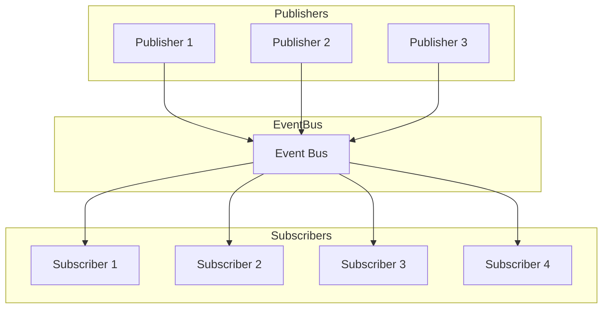

```mermaid
graph TD
    subgraph Publishers
        P1[Publisher 1]
        P2[Publisher 2]
        P3[Publisher 3]
    end
    
    subgraph EventBus
        EB[Event Bus]
    end
    
    subgraph Subscribers
        S1[Subscriber 1]
        S2[Subscriber 2]
        S3[Subscriber 3]
        S4[Subscriber 4]
    end
    
    P1 --> EB
    P2 --> EB
    P3 --> EB
    
    EB --> S1
    EB --> S2
    EB --> S3
    EB --> S4
```
